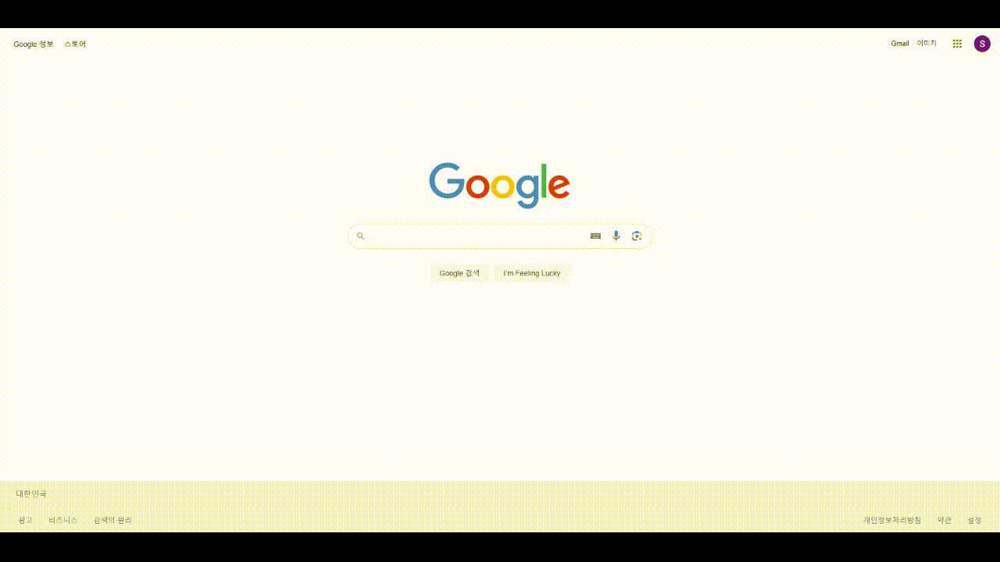

## 실습 기간

- 기간: 6월 27일~ 6월 28일

## 🔐 ERD 작성 및 DB 구축

  

## 팀원 및 역할

- 🤹‍♂️ 김명곤 
  - [LOGIN/LOGOUT](https://github.com/SSSanga/toy_servlet/blob/main/src/main/java/com/example/toy_servlet/controlls/LoginCreateServlet.java)
  - [FILTERS](https://github.com/SSSanga/toy_servlet/tree/main/src/main/java/com/example/toy_servlet/Filters)

  - 결과 page
      - 로그인
      .png)

- 🤹‍♀️ 김혜인 
  - [MEMBERS_LIST](https://github.com/SSSanga/toy_servlet/blob/main/src/main/java/com/example/toy_servlet/controlls/MembersServlet.java)
  - [MEMBER_DETAIL](https://github.com/SSSanga/toy_servlet/blob/main/src/main/java/com/example/toy_servlet/controlls/MembersInfoServlet.java)

  - 결과 page 

      - 회원 리스트  
      .png)
      - 회원 상세정보
      .png)
      - 설문자 합계 
      .PNG)
      
      

- 🤹 김상아
  - [SURVEY](https://github.com/SSSanga/toy_servlet/blob/main/src/main/java/com/example/toy_servlet/controlls/surveyServletJSPing.java)

  - 결과 page 
    
    - 설문지  
    .png)

### 🔓 홈페이지 동작 결과물 

##  📣 실습소감
- 혜인: 각자 맡은 파트가 다르다 보니 제가 하지 않은 부분은 내 것으로 만들지 못한 점이 아쉬웠습니다. 그렇지만 팀 과제를 통해서 서로 소통하는 것을 배울 수 있었고 내가 맡은 부분에 대해서 조금 더 이해할 수 있었던 시간이었습니다. 
- 상아: 1인분을 해내지 못해서 너무 아쉽다. SUBMIT후 통계 부분을 INSERT 할 수 있게 시도해 보겠습니다.
  다른 팀원들 수고했습니다!!!
- 명곤: 항상 느끼는 거지만 넘어야 할 산은 많고도 높지만 꾸준히 하나씩 올라가려고 합니다. 다들 고생하셨습니다.
